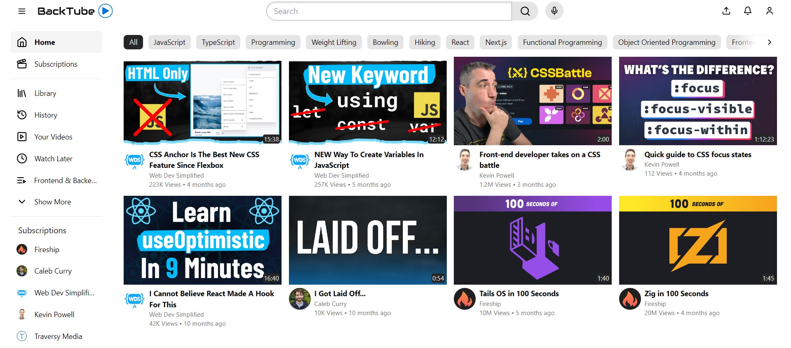

# BackTube

The clone of the YouTube Homepage



## Technologies Used

- **React:** A JavaScript library for building user interfaces.
- **TypeScript:** A typed superset of JavaScript that compiles to plain JavaScript.
- **Vite:** A fast build tool that provides a faster development experience for modern web projects.
- **Tailwind CSS:** A utility-first CSS framework for rapidly building custom designs.

## Running Locally

If you want to run the project locally, follow these steps:

```bash
# Clone the repository
git clone https://github.com/bakmaiev/backtube.git

# Navigate to the project directory
cd backtube

# Install dependencies
npm install

# Start the local development server
npm run dev
```
